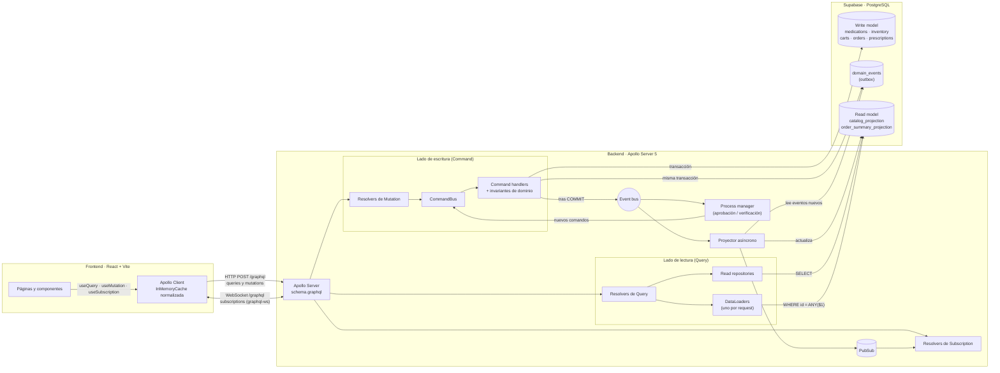
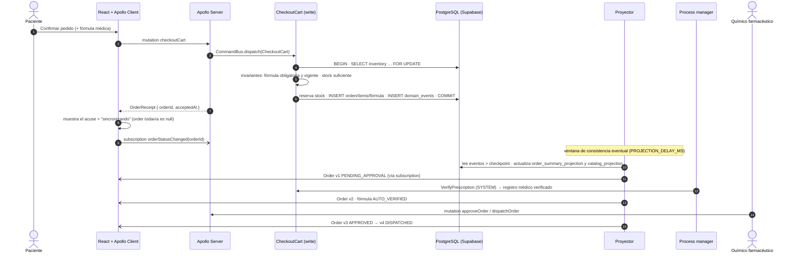

# Afirmative Pill · GraphQL + CQRS

E-commerce farmacéutico construido con **GraphQL como único canal cliente-servidor (Zero-REST)** y **CQRS**: los comandos (mutations) protegen las reglas de negocio sobre un modelo transaccional y las pantallas leen de proyecciones optimizadas para lectura.

| Capa | Tecnología |
|---|---|
| Frontend | React 19 · Vite · **Apollo Client 4** (`ApolloProvider`, `useQuery`, `useMutation`, `useSubscription`) · GraphQL Code Generator |
| Backend | Node.js · **Apollo Server 5** · Express 5 · `graphql-ws` (subscriptions) · DataLoader |
| Base de datos | **Supabase (PostgreSQL)** con conexión directa por protocolo Postgres (`pg`) |

**Integrantes:** _(completar)_

---

## Contenido

1. [Arquitectura](#1-arquitectura)
2. [Flujo de un pedido](#2-flujo-de-un-pedido-comando--proyección--tiempo-real)
3. [Cómo aplicamos CQRS](#3-cómo-aplicamos-cqrs)
4. [Cómo mitigamos el problema N+1](#4-cómo-mitigamos-el-problema-n1)
5. [Decisiones de diseño del schema](#5-decisiones-de-diseño-del-schema)
6. [Zero-REST](#6-zero-rest)
7. [Base de datos en Supabase](#7-base-de-datos-en-supabase)
8. [Puesta en marcha](#8-puesta-en-marcha)
9. [Usuarios y escenarios de prueba](#9-usuarios-y-escenarios-de-prueba)
10. [Estructura del repositorio](#10-estructura-del-repositorio)
11. [Pruebas automatizadas](#11-pruebas-automatizadas)
12. [Anexo: schema SDL completo](#anexo-schema-sdl-completo)

---

## 1. Arquitectura



- **Apollo Client** es el único que habla con el servidor. `ApolloProvider` envuelve toda la app ([`AuthProvider`](frontend/src/auth/AuthContext.tsx), montado en [`main.tsx`](frontend/src/main.tsx)). Un `ApolloLink.split` manda queries y mutations por HTTP y subscriptions por WebSocket, ambos a `/graphql` ([`apollo/client.ts`](frontend/src/apollo/client.ts)).
- **Apollo Server** expone un único schema ([`schema.graphql`](backend/src/schema/schema.graphql)). Los resolvers solo traducen: las Queries leen proyecciones y las Mutations despachan comandos.
- **Supabase** guarda tres grupos de tablas: el modelo de escritura, el event log (outbox) y el modelo de lectura.

## 2. Flujo de un pedido (comando → proyección → tiempo real)



## 3. Cómo aplicamos CQRS

### Segregación conceptual y técnica

| | Lado de comandos (write) | Lado de consultas (read) |
|---|---|---|
| Operaciones GraphQL | `Mutation.*` (10 comandos con intención de negocio) | `Query.*` y `Subscription.*` |
| Código | [`backend/src/write/`](backend/src/write): `commandBus.ts`, `commands/`, `domain/` | [`backend/src/read/`](backend/src/read): `repositories/`, `loaders/` |
| Tablas | Normalizadas: `medications`, `inventory`, `carts`, `orders`, `order_items`, `prescriptions` | Desnormalizadas: `catalog_projection`, `order_summary_projection` |
| Qué optimiza | Consistencia y atomicidad (transacciones y bloqueos de fila) | Velocidad de lectura (sin JOINs, índices trigram para búsqueda) |
| Qué devuelve | Un **acuse** (`OrderReceipt`, `aggregateVersion`) + errores de dominio tipados | Proyecciones listas para pintar |

Los resolvers de Mutation no contienen lógica: arman el comando, llaman a `CommandBus.dispatch()` y convierten el resultado en un payload ([`resolvers/mutations.ts`](backend/src/resolvers/mutations.ts)). Los resolvers de Query nunca invocan comandos.

Hay una excepción consciente: **el carrito** es un agregado de vida corta que el mismo paciente edita. Por eso `myCart` lee sus tablas con consistencia fuerte (*read-your-own-writes*); los datos de cada medicamento del carrito sí salen de la proyección.

### Manejo de invariantes

Las reglas farmacéuticas se validan dentro de la transacción del comando ([`commands/checkout.ts`](backend/src/write/commands/checkout.ts), [`domain/`](backend/src/write/domain)):

| Invariante | Dónde | Error tipado |
|---|---|---|
| No se crea un pedido con medicamentos `requires_prescription = true` sin fórmula | `checkoutCart` | `PrescriptionRequiredError` |
| La fórmula debe estar bien formada, no ser futura y tener máximo 30 días | `validatePrescription` | `ValidationError { field }` |
| No se vende lo que no hay: el stock se bloquea con `SELECT … FOR UPDATE` (ordenado por id para evitar deadlocks) y se reserva en la misma transacción | `checkoutCart` | `OutOfStockError { requested, available }` |
| Red de seguridad en la BD: `CHECK (available >= 0)` | migración 001 | — |
| Máquina de estados `PENDING_APPROVAL → APPROVED → DISPATCHED`, cancelable antes del despacho | `domain/order.ts` | `InvalidStateTransitionError { from, to }` |
| Un pedido con fórmula solo lo aprueba un humano (rol `PHARMACIST`) y nunca si la fórmula fue rechazada | `approveOrder` | `UnauthorizedError` / `ValidationError` |
| Cancelar o rechazar libera el stock reservado | `cancel()` | — |

Si un comando viola una invariante lanza `DomainFailure`: se hace **ROLLBACK** y el cliente recibe los errores en `payload.errors`. Ante una compra concurrente de las últimas unidades, un paciente gana y el otro recibe `OutOfStockError`. Esto se probó con dos checkouts simultáneos de las 20 unidades de insulina.

### Consistencia eventual: qué ve el usuario

1. **El comando confirma y responde un acuse, no la proyección.** `checkoutCart` devuelve `OrderReceipt { orderId, acceptedAt, total }`, generado por el write model en la misma transacción.
2. **Outbox y proyector asíncrono.** Los eventos (`OrderPlaced`, `InventoryReserved`, `PrescriptionVerified`, `OrderApproved`, …) se guardan en `domain_events` dentro de la transacción. El [proyector](backend/src/projections/projector.ts) los aplica después del COMMIT con una latencia configurable (`PROJECTION_DELAY_MS`) y guarda un *checkpoint*. Si el servidor se reinicia, retoma donde iba. La aplicación de eventos es **idempotente** gracias a las guardas `projection_version < $v` y `last_event_id < $id`.
3. **En la UI** ([`OrderDetailPage`](frontend/src/pages/OrderDetailPage.tsx)):
   - Mientras `order(id)` devuelve `null`, se muestra el acuse ("Pedido recibido ✔ · Sincronizando la vista del pedido…").
   - La proyección llega por **subscription** (`orderStatusChanged`). Además hay **polling de 1 s como respaldo** solo mientras la proyección no exista, para cubrir el caso de que el evento se emita antes de abrir el WebSocket.
   - Tras un comando posterior (cancelar, aprobar, despachar) el servidor devuelve `aggregateVersion`. La UI muestra "Actualizando…" mientras `order.projectionVersion < aggregateVersion`.
   - En el carrito, el stock se descuenta en caché al instante con `cache.modify`. El valor definitivo llega por la subscription `stockChanged`.
4. **Proyecciones desechables:** `npm run projections:rebuild` reconstruye todo el read model re-aplicando los eventos.

## 4. Cómo mitigamos el problema N+1

`Medication.laboratory`, `Medication.category`, `Medication.activeIngredient`, `OrderLine.medication`, `Order.patient`, `TherapeuticCategory.medications`, etc. se resuelven con **DataLoader** ([`read/loaders/index.ts`](backend/src/read/loaders/index.ts)):

- **Batching:** durante un mismo *tick*, GraphQL resuelve el campo `laboratory` de todos los medicamentos de la página. DataLoader junta las claves y hace **una** consulta `SELECT … WHERE id = ANY($1)`.
- **Caché por request:** si 12 medicamentos comparten 8 laboratorios, se piden 8 ids, no 12. Los loaders se crean **por operación** en el contexto, así que nunca se comparten datos entre usuarios. En subscriptions se desactiva la caché para que cada evento lea datos frescos.
- **Priming:** las filas del catálogo ya leídas se cargan en el loader `medication` para no volver a consultarlas.

Log real del servidor para `medications(first: 12) { edges { node { name laboratory { name } category { name } } } }`:

```text
[GraphQL req-83til] ▶ query CatalogoConLaboratorio
  [SQL req-83til #1] (catálogo) SELECT medication_id, sku, commercial_name, … FROM catalog_projection … LIMIT $1 [13] · 13 filas
[DataLoader req-83til] laboratory ← lote de 8 clave(s) [9, 5, 12, 14, 2, 4, 13, 3] → 1 consulta
[DataLoader req-83til] category ← lote de 9 clave(s) [1, 6, 13, 2, 7, 9, 14, 11, 3] → 1 consulta
  [SQL req-83til #2] (loader) SELECT id, name FROM laboratories WHERE id = ANY($1::int[]) [[9,5,12,14,2,4,13,3]] · 8 filas
  [SQL req-83til #3] (loader) SELECT id, name, slug FROM therapeutic_categories WHERE id = ANY($1::int[]) [[1,6,13,2,7,9,14,11,3]] · 9 filas
[GraphQL req-83til] ◀ query CatalogoConLaboratorio → 3 consulta(s) SQL · 20ms
```

**3 consultas** en lugar de 1 + 12 + 12 = 25. Para comprobarlo:

- `DATALOADER_ENABLED=false` en `backend/.env` apaga el batching y los logs muestran `[N+1] … → 1 consulta` por cada medicamento.
- El test [`tests/dataloader.test.ts`](backend/tests/dataloader.test.ts) ejecuta la query contra el schema real y verifica **3 SQL con DataLoader y 25 sin él**.

## 5. Decisiones de diseño del schema

- **Un solo tipo `Medication` y selección de campos por pantalla.** El catálogo pide el fragmento condensado `MedicationCard` (nombre, precio, presentación y dos banderas). La ficha técnica pide además laboratorio, principio activo, indicaciones y concentración. GraphQL resuelve el over-fetching sin crear endpoints ni DTOs distintos. Además, `totalCount` solo ejecuta el `COUNT(*)` si el cliente lo selecciona.
- **Scalars propios con validación en la frontera:** `Money` (string decimal, evita errores de punto flotante con pesos), `PositiveInt` (1-999, cantidades), `Date` (fecha de la fórmula, sin zona horaria), `DateTime` y `SKU` (`MED-000`). Una entrada inválida se rechaza antes de llegar al dominio.
- **Enums** para todos los estados: `OrderStatus`, `PrescriptionStatus`, `StockStatus`, `UserRole`, `ErrorCode`, `MedicationSortField`, `SortDirection`.
- **Mutations orientadas a intención** (`checkoutCart`, `approveOrder`, `dispatchOrder`, `cancelOrder`…), no CRUD genérico (`updateOrder(status)`). Cada una recibe un único `input` tipado y devuelve un **payload** propio.
- **Errores de dominio como datos:** `interface DomainError { code, message }` implementada por `OutOfStockError`, `PrescriptionRequiredError`, `InvalidStateTransitionError`, `ValidationError`, `NotFoundError` y `UnauthorizedError`. El cliente decide qué mostrar según `__typename` (por ejemplo, marca en rojo el campo `prescription.issuedAt`). Los errores técnicos o de autenticación de lectura siguen en `errors` de GraphQL con `extensions.code`.
- **Acuse vs. proyección:** las mutations devuelven `OrderReceipt` o `aggregateVersion` (write model) en lugar de fingir que la proyección ya está lista. Así el contrato hace explícita la consistencia eventual.
- **Paginación por cursor (keyset)** estilo Relay (`edges`, `pageInfo`, `after`). Es estable aunque cambien los datos y usa los índices `(commercial_name, id)` y `(price, id)`.
- **Filtros facetados en un input** (`MedicationFilter`): búsqueda sin tildes por nombre, principio activo o categoría, más categoría, laboratorio, fórmula, stock y rango de precio.
- **Subscriptions alimentadas por el proyector:** solo se emite lo que ya se puede consultar con una Query.

## 6. Zero-REST

- El backend monta **únicamente** `/graphql` (HTTP y WebSocket). Cualquier otra ruta responde 404 ([`index.ts`](backend/src/index.ts)).
- El login y el registro también son mutations (`login`, `registerPatient`), que emiten un JWT.
- El frontend no usa `fetch` ni `axios`: todo pasa por Apollo Client. En DevTools › Network (filtro `graphql`) solo aparecen `POST /graphql` y el WebSocket `/graphql`.
- El backend habla con Supabase por **protocolo PostgreSQL** (`pg`), no por la API REST de Supabase. Además, **RLS activado sin políticas** en todas las tablas: la API REST automática de Supabase (PostgREST) no expone ningún dato.

## 7. Base de datos en Supabase

Migraciones en [`supabase/migrations/`](supabase/migrations):

| Archivo | Contenido |
|---|---|
| `001_write_model.sql` | Enums, catálogo normalizado (laboratorios, categorías, principios activos, medicamentos), inventario con `available`/`reserved`, usuarios, carritos, órdenes, fórmulas y el outbox `domain_events` |
| `002_read_model.sql` | `catalog_projection`, `order_summary_projection`, `projection_checkpoints` |
| `003_indexes_rls.sql` | Índices de FKs, índice **GIN trigram** para búsqueda parcial, índices compuestos para la paginación keyset, índice único parcial "un carrito abierto por paciente" y RLS |

**Dataset:** los 50 medicamentos del Excel del taller están en [`data/medicamentos-dataset.xlsx`](data/medicamentos-dataset.xlsx) y exportados a [`data/medicamentos.csv`](data/medicamentos.csv). El seed ([`scripts/seed.ts`](backend/scripts/seed.ts)) los normaliza en 16 laboratorios, 14 categorías y 50 principios activos. También corrige 4 concentraciones que Excel había convertido en fracción (por ejemplo, `0.05` → `5 %`).

## 8. Puesta en marcha

**Requisitos:** Node.js 20 o superior y un proyecto de Supabase.

1. **Crear la base de datos en Supabase**
   1. En [supabase.com](https://supabase.com), crea un proyecto nuevo (región recomendada: São Paulo) y guarda la contraseña de la base de datos.
   2. Botón **Connect** → pestaña **Session pooler** → copia la *connection string*.
2. **Configurar el backend**
   ```bash
   cp backend/.env.example backend/.env
   ```
   En `backend/.env`, pega la connection string en `DATABASE_URL` (reemplazando `[YOUR-PASSWORD]`) y cambia `JWT_SECRET`.
3. **Instalar, migrar y cargar datos**
   ```bash
   npm install
   ```
   ```bash
   npm run db:migrate
   ```
   ```bash
   npm run db:seed
   ```
   En Supabase › Table Editor deberías ver 50 filas en `medications` y en `catalog_projection`.
4. **Ejecutar** (backend en `:4000`, frontend en `:5173`)
   ```bash
   npm run dev
   ```
   Abre http://localhost:5173. Apollo Sandbox para explorar el schema está en http://localhost:4000/graphql.

| Script | Qué hace |
|---|---|
| `npm run dev` | Backend y frontend en modo desarrollo |
| `npm run db:migrate` | Aplica las migraciones pendientes |
| `npm run db:seed` | Vacía y recarga el dataset, los usuarios demo y las proyecciones |
| `npm run projections:rebuild` | Reconstruye el read model re-aplicando los eventos |
| `npm run codegen` | Regenera los tipos del frontend a partir del schema |
| `npm test` | Pruebas del backend |

Variables útiles en `backend/.env`: `DATALOADER_ENABLED` (demostración de N+1), `LOG_SQL`, `PROJECTION_DELAY_MS`, `AUTO_APPROVAL_DELAY_MS` y `PRESCRIPTION_CHECK_DELAY_MS`.

## 9. Usuarios y escenarios de prueba

| Rol | Correo | Contraseña |
|---|---|---|
| Paciente | `paciente@afirmativepill.co` | `Paciente123!` |
| Paciente | `paciente2@afirmativepill.co` | `Paciente123!` |
| Químico farmacéutico | `farmaceutico@afirmativepill.co` | `Farmacia123!` |

La sesión se guarda por pestaña, así que puedes abrir el paciente y el farmacéutico en dos pestañas a la vez.

| Escenario | Cómo reproducirlo | Resultado |
|---|---|---|
| Pedido de venta libre | Carrito solo con OTC → Confirmar | Se aprueba automáticamente a los ~3 s (en vivo) |
| Fórmula obligatoria | Agregar un medicamento con ℞ y confirmar sin fórmula (por GraphQL) | `PrescriptionRequiredError` |
| Fórmula vencida | Fecha de emisión con más de 30 días | `ValidationError` en `prescription.issuedAt` |
| Verificación asíncrona | Registro médico válido (ej. `123456`) | Fórmula `AUTO_VERIFIED`; espera aprobación del farmacéutico |
| Rechazo automático | Registro médico que empieza por `0` (simulación de ReTHUS) | El pedido se cancela y se libera el stock |
| Stock insuficiente | Pedir más unidades que las disponibles | `OutOfStockError { requested, available }` |
| Transición inválida | Despachar un pedido aún pendiente | `InvalidStateTransitionError` |

## 10. Estructura del repositorio

```text
├── backend/
│   ├── src/
│   │   ├── index.ts                 Apollo Server + WebSocket, único endpoint /graphql
│   │   ├── schema/schema.graphql    contrato GraphQL (SDL)
│   │   ├── resolvers/               traducción GraphQL ↔ comandos / read model
│   │   ├── write/                   LADO DE COMANDOS: commandBus, commands/, domain/, events.ts
│   │   ├── read/                    LADO DE CONSULTAS: repositories/, loaders/ (DataLoader)
│   │   ├── projections/             proyector asíncrono, aplicación de eventos, rebuild
│   │   ├── workers/                 process manager (aprobación automática, verificación de fórmula)
│   │   └── shared/                  config, conexión pg con log de SQL, scalars, auth, pubsub
│   ├── scripts/                     migrate, seed, rebuild-projections
│   └── tests/                       vitest
├── frontend/
│   └── src/
│       ├── main.tsx                 árbol raíz (AuthProvider → ApolloProvider)
│       ├── apollo/client.ts         links HTTP/WS + InMemoryCache
│       ├── graphql/operations.ts    todas las queries, mutations, subscriptions y fragments
│       ├── gql/                     tipos generados (GraphQL Code Generator)
│       ├── pages/                   catálogo, ficha, carrito, pedido, mis pedidos, farmacia, login
│       └── components/
├── supabase/migrations/             SQL del write model, read model, índices y RLS
└── data/                            dataset de 50 medicamentos (xlsx original + csv)
```

## 11. Pruebas automatizadas

```bash
npm test
```

17 pruebas ([`backend/tests`](backend/tests)) cubren:

- La máquina de estados del pedido.
- El cálculo del total en centavos.
- La detección de todos los ítems sin stock.
- Las reglas de la fórmula médica.
- Los scalars `Money`, `PositiveInt` y `Date`.
- La normalización del dataset.
- El batching del DataLoader ejecutando queries reales contra el schema: 3 consultas con DataLoader frente a 25 sin él, y la vista condensada que no toca tablas relacionadas.

---

## Anexo: schema SDL completo

Fuente: [`backend/src/schema/schema.graphql`](backend/src/schema/schema.graphql)

```graphql
"""
Afirmative Pill · Contrato GraphQL (único canal cliente-servidor, Zero-REST).

Organización CQRS del contrato:
  · Query        → lecturas servidas desde proyecciones (read model).
  · Mutation     → comandos que expresan intención de negocio (write model).
  · Subscription → notificaciones cuando el read model se actualiza.
"""
schema {
  query: Query
  mutation: Mutation
  subscription: Subscription
}

# ═══════════════════════════════════════════════════════════════════════
# SCALARS PERSONALIZADOS
# ═══════════════════════════════════════════════════════════════════════

"Valor monetario en COP serializado como string decimal (\"9500.00\"). Nunca negativo."
scalar Money

"Entero entre 1 y 999. Se usa para cantidades de medicamentos."
scalar PositiveInt

"Fecha y hora ISO-8601 en UTC."
scalar DateTime

"Fecha calendario YYYY-MM-DD (sin hora)."
scalar Date

"Código de producto con formato MED-000."
scalar SKU

# ═══════════════════════════════════════════════════════════════════════
# ENUMS
# ═══════════════════════════════════════════════════════════════════════

"Estado operacional del pedido (máquina de estados del agregado Order)."
enum OrderStatus {
  "Pedido recibido; espera aprobación (automática si es OTC, del químico farmacéutico si requiere fórmula)."
  PENDING_APPROVAL
  "Pedido aprobado; listo para despacho."
  APPROVED
  "Pedido despachado al paciente (estado final)."
  DISPATCHED
  "Pedido cancelado por el paciente o rechazado; el stock reservado se libera (estado final)."
  CANCELLED
}

"Estado de la verificación de la fórmula médica."
enum PrescriptionStatus {
  "Recibida, aún sin verificar."
  PENDING_REVIEW
  "El verificador automático confirmó el registro médico del prescriptor."
  AUTO_VERIFIED
  "Aprobada por el químico farmacéutico."
  APPROVED
  "Rechazada: el pedido se cancela."
  REJECTED
}

enum UserRole {
  PATIENT
  PHARMACIST
}

"Disponibilidad calculada a partir del stock proyectado."
enum StockStatus {
  IN_STOCK
  "Menos de 10 unidades disponibles."
  LOW_STOCK
  OUT_OF_STOCK
}

enum MedicationSortField {
  NAME
  PRICE
}

enum SortDirection {
  ASC
  DESC
}

"Código estable de error de dominio, pensado para que el cliente decida qué mostrar."
enum ErrorCode {
  OUT_OF_STOCK
  PRESCRIPTION_REQUIRED
  INVALID_STATE_TRANSITION
  EMPTY_CART
  VALIDATION
  NOT_FOUND
  UNAUTHORIZED
  INVALID_CREDENTIALS
}

# ═══════════════════════════════════════════════════════════════════════
# CATÁLOGO (read model: catalog_projection + datos maestros)
# ═══════════════════════════════════════════════════════════════════════

"""
Medicamento del catálogo. El cliente decide qué campos pedir: la vista de
exploración pide solo nombre, precio y presentación; la ficha técnica pide
laboratorio, principio activo, indicaciones, etc. Las entidades anidadas se
resuelven con DataLoader (sin N+1).
"""
type Medication {
  id: ID!
  sku: SKU!
  "Nombre comercial."
  name: String!
  presentation: String!
  dosage: String!
  price: Money!
  "true → exige fórmula médica verificada para poder comprarse."
  requiresPrescription: Boolean!
  "Indicaciones clínicas / descripción."
  indications: String!
  "Unidades disponibles según la proyección (puede ir unos instantes detrás del inventario real)."
  stockAvailable: Int!
  stockStatus: StockStatus!
  activeIngredient: ActiveIngredient!
  category: TherapeuticCategory!
  laboratory: Laboratory!
  "Momento en que la proyección de este medicamento se actualizó por última vez."
  updatedAt: DateTime!
}

type ActiveIngredient {
  id: ID!
  name: String!
  medications: [Medication!]!
}

type TherapeuticCategory {
  id: ID!
  name: String!
  slug: String!
  medicationCount: Int!
  medications: [Medication!]!
}

type Laboratory {
  id: ID!
  name: String!
  medications: [Medication!]!
}

"Paginación por cursor (keyset) estilo Relay."
type MedicationConnection {
  edges: [MedicationEdge!]!
  pageInfo: PageInfo!
  "Solo se calcula (COUNT) si el cliente lo pide."
  totalCount: Int!
}

type MedicationEdge {
  cursor: String!
  node: Medication!
}

type PageInfo {
  hasNextPage: Boolean!
  endCursor: String
}

"Filtros facetados del catálogo. Todos son opcionales y se combinan con AND."
input MedicationFilter {
  "Busca en nombre comercial, principio activo y categoría (sin distinguir tildes ni mayúsculas)."
  search: String
  categoryIds: [ID!]
  laboratoryIds: [ID!]
  requiresPrescription: Boolean
  inStockOnly: Boolean
  minPrice: Money
  maxPrice: Money
}

input MedicationSort {
  field: MedicationSortField! = NAME
  direction: SortDirection! = ASC
}

# ═══════════════════════════════════════════════════════════════════════
# USUARIOS
# ═══════════════════════════════════════════════════════════════════════

type User {
  id: ID!
  email: String!
  fullName: String!
  role: UserRole!
}

# ═══════════════════════════════════════════════════════════════════════
# CARRITO (agregado de escritura de vida corta)
# ═══════════════════════════════════════════════════════════════════════

type Cart {
  id: ID!
  items: [CartItem!]!
  itemCount: Int!
  subtotal: Money!
  "true si al menos un ítem exige fórmula: el checkout pedirá PrescriptionInput."
  requiresPrescription: Boolean!
}

type CartItem {
  medication: Medication!
  quantity: PositiveInt!
  lineTotal: Money!
}

# ═══════════════════════════════════════════════════════════════════════
# PEDIDOS (read model: order_summary_projection)
# ═══════════════════════════════════════════════════════════════════════

"Proyección del pedido optimizada para lectura."
type Order {
  id: ID!
  status: OrderStatus!
  "Motivo de cancelación/rechazo o nota de aprobación."
  statusReason: String
  total: Money!
  itemCount: Int!
  items: [OrderLine!]!
  requiresPrescription: Boolean!
  prescription: PrescriptionSummary
  patient: User!
  placedAt: DateTime!
  updatedAt: DateTime!
  "Versión del agregado que refleja esta proyección (sube con cada evento aplicado)."
  projectionVersion: Int!
}

type OrderLine {
  "Medicamento actual del catálogo (resuelto con DataLoader)."
  medication: Medication!
  "Nombre congelado en el momento de la compra."
  medicationName: String!
  presentation: String!
  quantity: PositiveInt!
  "Precio congelado en el momento de la compra."
  unitPrice: Money!
  lineTotal: Money!
  requiresPrescription: Boolean!
}

type PrescriptionSummary {
  doctorName: String!
  doctorLicense: String!
  prescriptionCode: String!
  issuedAt: Date!
  status: PrescriptionStatus!
  notes: String
}

"""
Acuse de recibo del comando de compra, generado por el write model en la misma
transacción. La proyección `Order` aparece unos instantes después
(consistencia eventual) y se notifica por `orderStatusChanged`.
"""
type OrderReceipt {
  orderId: ID!
  status: OrderStatus!
  total: Money!
  itemCount: Int!
  requiresPrescription: Boolean!
  acceptedAt: DateTime!
}

# ═══════════════════════════════════════════════════════════════════════
# ERRORES DE DOMINIO (tipados, dentro de los payloads)
# ═══════════════════════════════════════════════════════════════════════

"Error de negocio esperado. Los errores técnicos van en `errors` de la respuesta GraphQL."
interface DomainError {
  code: ErrorCode!
  message: String!
}

"No hay unidades suficientes para cubrir la cantidad pedida."
type OutOfStockError implements DomainError {
  code: ErrorCode!
  message: String!
  medication: Medication!
  requested: Int!
  available: Int!
}

"Uno o más medicamentos exigen fórmula médica y no se envió PrescriptionInput."
type PrescriptionRequiredError implements DomainError {
  code: ErrorCode!
  message: String!
  medications: [Medication!]!
}

"El pedido no puede pasar del estado actual al solicitado."
type InvalidStateTransitionError implements DomainError {
  code: ErrorCode!
  message: String!
  from: OrderStatus!
  to: OrderStatus!
}

"Dato de entrada inválido. `field` indica el campo (ej. prescription.issuedAt)."
type ValidationError implements DomainError {
  code: ErrorCode!
  message: String!
  field: String!
}

type NotFoundError implements DomainError {
  code: ErrorCode!
  message: String!
  entity: String!
  id: ID!
}

type UnauthorizedError implements DomainError {
  code: ErrorCode!
  message: String!
}

# ═══════════════════════════════════════════════════════════════════════
# INPUTS DE COMANDOS
# ═══════════════════════════════════════════════════════════════════════

input LoginInput {
  email: String!
  password: String!
}

input RegisterPatientInput {
  email: String!
  fullName: String!
  password: String!
}

input AddItemToCartInput {
  medicationId: ID!
  quantity: PositiveInt!
}

input UpdateCartItemQuantityInput {
  medicationId: ID!
  quantity: PositiveInt!
}

input RemoveItemFromCartInput {
  medicationId: ID!
}

"Soporte de la fórmula médica."
input PrescriptionInput {
  doctorName: String!
  "Registro médico del prescriptor (4 a 10 dígitos)."
  doctorLicense: String!
  prescriptionCode: String!
  "Fecha de emisión: no puede ser futura ni tener más de 30 días."
  issuedAt: Date!
}

input CheckoutCartInput {
  "Obligatoria si el carrito contiene medicamentos con requiresPrescription = true."
  prescription: PrescriptionInput
}

input ApproveOrderInput {
  orderId: ID!
  notes: String
}

input RejectOrderInput {
  orderId: ID!
  reason: String!
}

input DispatchOrderInput {
  orderId: ID!
}

input CancelOrderInput {
  orderId: ID!
  reason: String
}

# ═══════════════════════════════════════════════════════════════════════
# PAYLOADS DE COMANDOS
# ═══════════════════════════════════════════════════════════════════════

type AuthPayload {
  token: String
  user: User
  errors: [DomainError!]!
}

type CartPayload {
  cart: Cart
  errors: [DomainError!]!
}

type CheckoutCartPayload {
  receipt: OrderReceipt
  errors: [DomainError!]!
}

"Acuse de una transición de estado del pedido (write model)."
type OrderTransitionPayload {
  orderId: ID
  status: OrderStatus
  "Nueva versión del agregado. La proyección la alcanzará en breve."
  aggregateVersion: Int
  errors: [DomainError!]!
}

# ═══════════════════════════════════════════════════════════════════════
# OPERACIONES
# ═══════════════════════════════════════════════════════════════════════

type Query {
  "Exploración del catálogo con filtros facetados y paginación por cursor (máx. 50 por página)."
  medications(filter: MedicationFilter, sort: MedicationSort, first: Int = 12, after: String): MedicationConnection!
  "Ficha técnica de un medicamento."
  medication(id: ID!): Medication
  therapeuticCategories: [TherapeuticCategory!]!
  laboratories: [Laboratory!]!
  "Usuario autenticado (null si no hay sesión)."
  me: User
  "Carrito abierto del paciente autenticado."
  myCart: Cart
  "Pedidos proyectados del paciente autenticado, del más reciente al más antiguo."
  myOrders(status: OrderStatus): [Order!]!
  "Proyección de un pedido. null si no existe o si la proyección aún no se ha generado."
  order(id: ID!): Order
  "Cola de trabajo del químico farmacéutico (rol PHARMACIST)."
  pharmacyQueue(statuses: [OrderStatus!] = [PENDING_APPROVAL, APPROVED]): [Order!]!
}

type Mutation {
  login(input: LoginInput!): AuthPayload!
  registerPatient(input: RegisterPatientInput!): AuthPayload!

  "Agrega un medicamento al carrito (lo crea si no existe). Suma a la cantidad si ya estaba."
  addItemToCart(input: AddItemToCartInput!): CartPayload!
  updateCartItemQuantity(input: UpdateCartItemQuantityInput!): CartPayload!
  removeItemFromCart(input: RemoveItemFromCartInput!): CartPayload!

  """
  Convierte el carrito en un pedido: valida fórmula médica, reserva stock de forma
  atómica y registra los eventos de dominio. Devuelve un acuse; la proyección
  del pedido se genera de forma asíncrona.
  """
  checkoutCart(input: CheckoutCartInput!): CheckoutCartPayload!

  "PHARMACIST · aprueba un pedido PENDING_APPROVAL (valida que la fórmula no esté rechazada)."
  approveOrder(input: ApproveOrderInput!): OrderTransitionPayload!
  "PHARMACIST · rechaza un pedido; libera el stock reservado."
  rejectOrder(input: RejectOrderInput!): OrderTransitionPayload!
  "PHARMACIST · despacha un pedido APPROVED."
  dispatchOrder(input: DispatchOrderInput!): OrderTransitionPayload!
  "PATIENT dueño del pedido · cancela un pedido aún no despachado; libera el stock."
  cancelOrder(input: CancelOrderInput!): OrderTransitionPayload!
}

type Subscription {
  """
  Emite la proyección del pedido cada vez que cambia.
  Con orderId: solo ese pedido. Sin orderId: todos los pedidos del paciente
  autenticado (o todos, si es PHARMACIST).
  """
  orderStatusChanged(orderId: ID): Order!
  "Emite el medicamento cuando cambia su stock proyectado (reservas, cancelaciones)."
  stockChanged(medicationIds: [ID!]): Medication!
}
```
